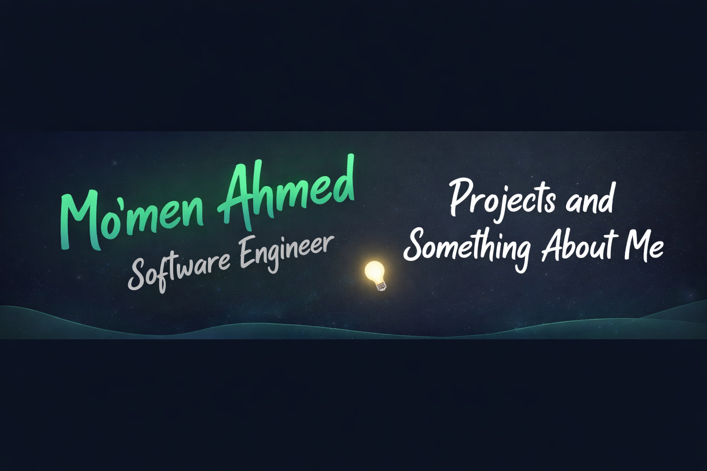

### 👨‍💻 About Me

I’m a **Software Engineering student** with a strong interest in  
**Artificial Intelligence & Machine Learning**.

I enjoy building intelligent systems, working with data,  
and turning ideas into real projects using **Python** and ML tools.  

Currently learning, practicing, and preparing for  
**internships and junior opportunities** 🚀
### 🛠 Languages & Tools

  

### 🚀 Skills

- Python Programming  
- Object-Oriented Programming (OOP)  
- Data Structures & Algorithms  
- Machine Learning Basics  
- Linux & Git  
- Problem Solving  
### 📂 Projects

🚧 Projects are coming soon...  
Currently working on Python & Machine Learning projects.
### 📊 GitHub Stats

### 📫 Contact Me

- 💼 LinkedIn: https://www.linkedin.com/in/USERNAME  
- 📧 Email: momenahmedeltelt@gmail.com
